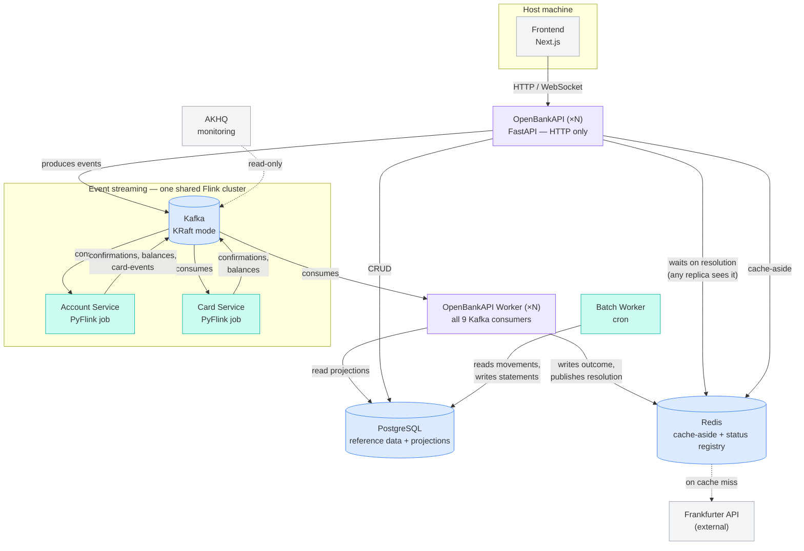

# OpenBankAPI — Backend
Financial systems are a great example of a piece of software in which non-functional requirements are critically important. A concurrency issue can lead huge losses, a wrong fault recovery policy can affect the data of thousands of transactions, and, missing idempotency in requests can lead to duplicated charges for users. 

Thinking about this kind of systems, I decided to implement a simulation of how banking software could avoid those issues, and, take the most out of architectural design so every component either of processing or storing data, brings the right functionality so the system can be reliable, fault-tolerant and scalable.

The implemented features are accounts, and money movement, with internal transfers among accounts, and multi-currency support. And a credit-card feature that allows the bank to issue cards, generate purchases and allow the user to pay againts the card balance. The system handles monthly billing statements: automatic close/due-date batch job, late fees, minimum payment, interest on unpaid balances carried into the next cycle.

With these features, there is enough challenges to use stream and batch processing tools, to really feel the features that each used tool provides.

## Running

```bash
docker compose up --build -d
```

```bash
cd frontend && npm install && npm run dev
```

It talks to `http://localhost:8000` by default; override with
`NEXT_PUBLIC_GATEWAY_URL` in `frontend/.env.local`.


| Surface           | URL                                                              |
| ----------------- | ---------------------------------------------------------------- |
| Gateway           | [http://localhost:8000](http://localhost:8000) (docs at `/docs`) |
| Flink dashboard   | [http://localhost:8081](http://localhost:8081)                   |
| AKHQ (Kafka UI)   | [http://localhost:8080](http://localhost:8080)                   |
| Kafka (from host) | `localhost:9092`                                                 |


## Tests

```bash
python3 -m pytest              # backend: 46 tests
cd frontend && npm test        # frontend: 10 tests
```

No broker or cluster required for either — the ledger rules are pure functions,
Kafka sits behind a port the tests fake, and the frontend's money and wire
parsing are pure too.

## Layout

```
docker-compose.yml          Kafka (KRaft) + topic init + Flink jobs + Postgres + gateway + AKHQ
flink/                      Both PyFlink jobs, sharing one jobmanager/taskmanager cluster
  account-service/
    domain.py                 Pure ledger rules — no Flink imports
    job.py                    PyFlink wiring: source, keyed state, sinks
    java/                     One class: the field-extracting serialization schema
    submit.sh                 Waits for a task slot, then submits the job
    tests/                    Ledger rules and routing edge cases
  card-service/
    domain.py                 Pure credit-card balance and authorization rules
    job.py                    PyFlink wiring, mirroring account-service
    tests/                    Card balance and authorization rules
openbankapi/                FastAPI gateway, Domain-Driven Design layout
  domain/model/             Entities: account, customer, card, card_account, card_movement, statement, installment
  domain/events/            Domain events, independent of any wire format
  domain/service/           Use cases: transfers, accounts, statements, current-cycle projection
  domain/exceptions.py      Errors that carry meaning, not status codes
  api/routers/              Routers — the API contract
  api/dtos/                 Request/response DTOs
  infra/database/           ORM, repository ports, Postgres implementations, Alembic migrations
  infra/cache/              ICacheService port + Redis adapter
  infra/status_registry/    Redis-backed IStatusRegistry — cross-replica visibility for async write outcomes
  infra/kafka/              Publisher port, producer, all 9 consumers
  infra/foreign_exchange_service/  Currency conversion for non-USD transfers and purchases
  batch/                    Scheduled statement close and due-date checks
  seed/                     Deterministic demo data (customer, accounts, cards, billing cycles)
  composition.py            Shared composition root — everything both main.py and worker.py need
  main.py                   HTTP process entry point: routers, no Kafka consumers
  worker.py                 Kafka-consumer process entry point: all 9 consumers, no HTTP
  tests/                    Every layer, with fakes for every port
frontend/                   Next.js App Router + TypeScript, feature-oriented
  app/                      Route groups only — thin, composes screens from features/
  features/                 One folder per business capability: accounts, transfers, deposits,
                             withdrawals, customers, credit-cards, card-account-admin
  components/ui/            Shared UI primitives
  lib/api/                  Gateway HTTP client
  lib/money.ts              Integer-cent formatting and parsing
```

## Architecture

This system simulates a bank's backend using an **event-sourced,
stream-processing architecture**, inspired by the approach to data-intensive
systems described in *Designing Data-Intensive Applications* (Kleppmann).
Rather than coordinating changes across multiple accounts with distributed
transactions, the system funnels all state-changing operations through a
single, ordered, partitioned log (Kafka), and derives every other
representation of the data — balances, statements, caches — from that log.




### Components

**Frontend — Next.js (TypeScript)**
The only client-facing surface. Talks to OpenBankAPI exclusively over
HTTP/WebSocket; holds no business logic of its own.

**OpenBankAPI — FastAPI (Python)**
The single HTTP entry point, runnable as N stateless replicas behind nginx.
Its job is translation, not decision-making: it turns synchronous HTTP
requests into events on the write path (producing to Kafka), and turns
asynchronous confirmations back into synchronous-feeling responses on the
read path (via WebSocket push or a request that waits on a matched
confirmation, using the status registry below). It also owns plain CRUD
("ABM") for low-contention reference data — customers, branches, cards'
metadata — that doesn't need event sourcing at all. It runs **no Kafka
consumers of its own** — see OpenBankAPI Worker.

**OpenBankAPI Worker — FastAPI's process split (Python)**
A separate process (`python -m openbankapi.worker`, its own replica count,
independent of the HTTP tier) running all 9 Kafka consumers: the ones that
project Flink's decisions into Postgres read models, and the five that
resolve async write outcomes (transfer/purchase/card-payment/deposit/
withdrawal status). This split exists because those consumers used to run
*inside* the same process as the HTTP server, with each resolved outcome
held in an **in-memory** registry — the process that accepted a request was
the only one that could ever answer "is it done yet." Once `openbankapi`
needed more than one replica, that stopped working: a client polling
replica B for a request replica A accepted would see `pending` forever, not
because the system was overloaded, but because the answer lived in a
process the poll could never reach. Splitting Kafka consumption into its
own process and moving the status registry to Redis (SET NX + Pub/Sub, so
any replica can see a resolution any worker wrote) fixed that — and, as a
side effect, let the consumer tier be scaled independently of the HTTP
tier once Kafka partitions were verified to actually split across worker
replicas (a shared `group.id` was required for that; see the stress-testing
report below for the fan-out bug this surfaced and fixed).

**Apache Kafka (KRaft mode)**
The shared, ordered, partitioned log at the center of the system. Two
properties make it the backbone rather than just a message queue: partitions
give deterministic sharding (all events for one account/card always land on
the same partition, in order), and durability makes the log replayable,
which is what makes crash recovery and multiple independent consumers
possible without coordination between them.

**Apache Flink (PyFlink) — Account Service & Card Service**
Two independent stream-processing jobs, each the sole authority over one
kind of contended state: the Account Service decides whether a transfer or
deposit is valid against a bank account's balance; the Card Service decides
whether a purchase is valid against a card's available credit. Each shards
by the relevant entity id, so state for a given account/card is always
processed sequentially by exactly one task — this sequential-per-shard
guarantee is what replaces the need for distributed transactions or locks
when checking "is there enough balance/credit" under concurrent requests.

Both jobs run on **one shared jobmanager/taskmanager cluster**, not one
dedicated cluster each. They used to be fully separate (four JVMs total);
that changed after load testing showed the fixed overhead of four JVMs
on one machine was enough to get the jobmanager OOM-killed under
sustained load. Consolidating was safe because each job already ships its
own code to the cluster *at submission time* (`flink run --pyFiles`), so
the runtime itself never needed to know about either job's domain logic —
only the code that submits a job differs, not the cluster it runs on. The
two jobs remain fully independent otherwise: separate checkpoints, separate
failure domains for a code-level bug in one job's logic (though not for an
infrastructure-level failure of the shared cluster process itself — see
the report below for that tradeoff).

**PostgreSQL**
Two distinct roles, intentionally separated: (1) reference/master data
(customers, branches, accounts, card accounts) managed as plain CRUD, and
(2) **read-model projections** — account balances, card balances, movement
history, exchange-rate audit records — populated asynchronously by
dedicated Kafka consumers that translate the event log into queryable
tables. Postgres is never the source of truth for a balance; it's always a
derived, eventually-consistent view of what Flink already decided.

**Redis**
Two distinct roles. (1) Cache-aside for data that's read far more often
than it changes: foreign exchange rates (refreshed from an external API on
a 24h TTL) and reference data lookups — deliberately *not* used for
anything Flink owns, since a cache in front of already-fast Postgres reads
was judged unnecessary complexity for values that already have a dedicated
projection. (2) The **status registry**: `SET ... NX` for dedup (a
redelivered Kafka event is a safe no-op) plus Pub/Sub for notification,
subscribed *before* the first cache check to close a lost-wakeup race —
this is what lets any `openbankapi` HTTP replica see a resolution written
by any `openbankapi-worker` replica, the piece that makes both tiers safe
to run as more than one instance.

**Frankfurter API (external)**
Source of foreign exchange mid-market rates (USD/EUR/GBP). Fetched
on-demand and cached, not polled on a schedule — the rate data itself only
changes about once a day, so a scheduled publisher was replaced with
simple fetch-on-cache-miss once that was recognized.

**Batch worker (cron, separate container)**
Runs the one genuinely batch (non-streaming) process in the system: monthly
credit card statement closing, interest calculation, and late-fee
application. Deliberately isolated from OpenBankAPI's process (so it scales
and fails independently of the API) and deliberately *not* built on a full
workflow orchestrator like Airflow — the job is a single task type with no
inter-task dependencies, so a lightweight cron trigger plus idempotent,
data-driven processing logic provides the same reliability properties
without the operational weight.

**AKHQ**
Read-only Kafka inspection — topics, partitions, consumer group lag. Not
part of any data path; exists purely to make the system's internal state
observable during development.

### How a write flows through the system

1. A client calls OpenBankAPI over HTTP.
2. OpenBankAPI resolves anything it can answer authoritatively itself
  (does the account exist, what currency is it, does a purchase need FX
   conversion) and produces **one** event to Kafka, keyed by the entity
   whose state is being changed.
3. That single, atomic write is the only thing that has to succeed
  synchronously. Everything after it — the actual balance check and
   decision, derived events, projections, audit records — happens
   asynchronously, consumed from the log.
4. Flink makes the one decision that actually requires sequencing
  (sufficient balance/credit), deterministically and idempotently, and
   emits the outcome back onto the log.
5. `openbankapi-worker` — a separate process from the one that accepted
  the request — consumes that outcome, projects it into whatever Postgres
   tables the read side needs, and writes the resolution to Redis. Whichever
   `openbankapi` replica the client happens to be polling reads that
   resolution back out of Redis and returns it — not necessarily the same
   replica that accepted the original request.


### Built from load testing, not speculative design

The worker split and the Flink consolidation above weren't designed
upfront — both came out of running actual load tests against the system,
finding where it broke, and fixing exactly that. Full experiment log,
methodology, and root-cause analysis: [`docs/stress-testing-report.md`](docs/stress-testing-report.md).

- **Why `openbankapi-worker` exists at all**: scaling `openbankapi` to
  multiple replicas with Kafka consumers still running inside it — and an
  in-memory status registry — meant a request accepted by one replica could
  never be resolved by a client polling a different one. This wasn't
  theoretical: it showed up immediately as requests timing out under load
  the moment more than one replica was tested. Moving consumption to a
  separate process and the registry to Redis fixed it, and was then
  independently verified with real numbers, not just "it should work now."
- **Was it worth it?** Yes, measurably: at the same load (2 API + 2 worker
  replicas vs. 1 + 1, everything else held constant), 2 replicas beat 1 by
  13–26% on throughput once load passed ~50 concurrent virtual users, with
  the advantage *growing* as load increased — the signature of a real
  capacity ceiling being relieved, not overhead outweighing benefit.
- **Why the Flink jobs were consolidated onto one cluster**: four separate
  JVM processes (two jobmanager/taskmanager pairs) sharing one Docker
  Desktop VM's memory budget got the jobmanager OOM-killed under load — an
  observed failure, not a hypothetical one, caught mid-experiment via
  `docker compose ps -a` showing exit code 137 (SIGKILL).
- **Did consolidating cost anything?** No — re-run twice for reproducibility
  at the same topology, the single-cluster config *beat* the old four-JVM
  setup on both throughput (+15% to +25% at every load level tested) and
  latency (transfer accept p95 fell from ~2.3s to under a second at 200
  concurrent VUs), on top of removing the failure mode that motivated the
  change.

## Non-Functional Requirements Addressed


| Requirement                                                  | How it's addressed                                                                                                                                                                                                                                                                                                                                                                                      |
| ------------------------------------------------------------ | ------------------------------------------------------------------------------------------------------------------------------------------------------------------------------------------------------------------------------------------------------------------------------------------------------------------------------------------------------------------------------------------------------- |
| **Consistency without distributed transactions**             | Multi-entity operations (a transfer touching three accounts, a purchase reserving credit) achieve atomicity through a single durable log write plus deterministic, idempotent downstream processing — not two-phase commit.                                                                                                                                                                             |
| **Horizontal scalability**                                   | Kafka partitioning and Flink's parallel task model mean throughput scales by adding partitions and worker capacity, not by making a single process faster. Sharding key choice (account number, card account id) directly determines what can be parallelized safely. `openbankapi` and `openbankapi-worker` are both stateless replica sets for the same reason — no in-process state a load balancer or Kafka rebalance could strand on one instance; verified with measured throughput/latency gains as replica count increased, not just "should scale in theory" (see the load-testing section above). |
| **Fault tolerance / crash recovery**                         | Flink checkpoints state and consumed offsets together, atomically, so a crash-and-restart resumes exactly where it left off without data loss or double-processing. Combined with idempotent handlers and end-to-end request ids, at-least-once delivery never becomes at-least-once *effect*.                                                                                                          |
| **Low-latency reads under a write-heavy, asynchronous core** | Because the authoritative decision-making (Flink) can't be queried directly, dedicated consumers continuously project results into read-optimized Postgres tables (balances, movement history). Reads never wait on or block the write path.                                                                                                                                                            |
| **Auditability**                                             | The event log is the immutable system of record; every account/card movement, currency conversion, and privileged admin action (deposits, limit changes, status changes) is written to an append-only table with enough context to reconstruct exactly what happened and why — not just that a number changed.                                                                                          |
| **Idempotency under retries**                                | A client-generated request id is threaded through every layer — HTTP request, Kafka event, Flink state, Postgres inserts — so a redelivered or retried operation is a safe no-op instead of a duplicate effect (double-charging, double-crediting).                                                                                                                                                     |
| **Fault isolation**                                          | Asynchronous, log-based integration means a slow or failing consumer (e.g. a projection job) degrades gracefully instead of cascading failure back to the producer or to unrelated consumers of the same event.                                                                                                                                                                                         |
| **Separation of concerns / maintainability**                 | A layered (domain / controllers / infrastructure) structure keeps business rules, HTTP concerns, and external integrations independently testable and replaceable. High-contention flows (transfers, purchases) are architecturally distinguished from low-contention reference data (customers, branches), which is deliberately kept as plain CRUD rather than forced through the event-sourced path. |
| **Operational proportionality**                              | Infrastructure choices are matched to actual load characteristics rather than defaulted to the heaviest available tool — e.g., FX rate fetching uses on-demand caching instead of a streaming pipeline once its true update frequency was known, and the batch job uses cron instead of a full workflow orchestrator, since it has no multi-task dependency graph to manage.                           

## Notes and known limits

- **The fee for transactions is flat** (`FEE_FLAT_CENTS`, default 25,
capped at the transfer amount.
- **Sinks are at-least-once**. Checkpointing is `EXACTLY_ONCE` for
Flink's internal state, which is what protects `balance` and `processed_ids`.
- `POST /transfer` **does not wait for the broker ack**. A broker
outage surfaces in the producer's delivery callback (logged), not in the HTTP
response.
- **Balances are Flink state, not a queryable store.** There is no
`GET /accounts/{id}/balance`; the spec does not define one. Inspect state
through the emitted events in AKHQ.

