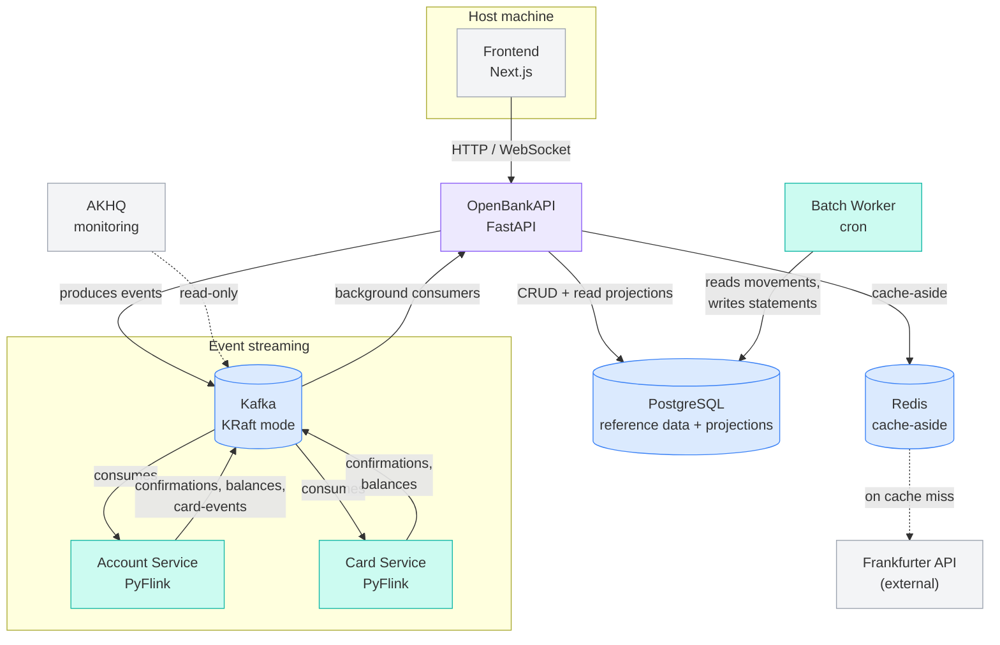

# OpenBankAPI — Backend

Implementation of `[openbankapi-spec-v2.md](openbankapi-spec-v2.md)` (which
supersedes `[system_spec.md](system_spec.md)`): a multishard payment flow built
on event logs and stream processing, with no distributed transaction, plus the
relational reference data and read model that v2 adds.

Backend and frontend. The Next.js app runs on the host, outside Compose, and
talks to the gateway directly (§7, §8).

## Layout

```
docker-compose.yml          Kafka (KRaft) + topic init + Flink + gateway + AKHQ
account-service/
  domain.py                 Pure ledger rules (§5.3) — no Flink imports
  job.py                    PyFlink wiring: source, keyed state, sinks (§5)
  java/                     One class: the field-extracting serialization schema
  submit.sh                 Waits for a task slot, then submits the job
  tests/test_domain.py      Ledger rules, incl. the §9 scenarios
openbankapi/                Domain-Driven Design layout (v2 §7.1)
  domain/model/             Entities: account, customer, branch, location
  domain/events/            Domain events, independent of any wire format
  domain/service/           Use cases: transfer, account
  domain/exceptions.py      Errors that carry meaning, not status codes
  controllers/              Routers + DTOs (the API contract)
  infra/database/           ORM, repository ports, Postgres implementations
  infra/cache/              ICacheService port + Redis adapter
  infra/kafka/              Publisher port, producer, both consumers
  main.py                   Composition root
  tests/                    Every layer, with fakes for every port
infra/postgres/init.sql     The four tables from v2 §3, in English
frontend/                   Next.js App Router + TypeScript (§7)
  app/page.tsx              The single page
  components/               Form, outcome view, and the state machine
  lib/gateway.ts            POST, WebSocket watch, status fallback
  lib/money.ts              Integer-cent formatting and parsing
```


## Running

```bash
docker compose up --build -d
```

Seed some balances (the ledger has no deposit concept — a balance is whatever
the account's event log says):

```bash
docker compose exec openbankapi python -m openbankapi.seed 1234567890123456=500000
```

Send a transfer:

```bash
curl -s -X POST localhost:8000/transfer -H 'content-type: application/json' -d '{"source_account":"acc-123","destination_account":"acc-456","amount":1100}'
```

Then poll `GET localhost:8000/transfer/<request_id>/status`, or hold
`ws://localhost:8000/ws/transfer/<request_id>`.

Or use the UI. The frontend is deliberately **not** in Compose (§8) — run it on
the host for fast iteration:

```bash
cd frontend && npm install && npm run dev
```

It talks to `http://localhost:8000` by default; override with
`NEXT_PUBLIC_GATEWAY_URL` in `frontend/.env.local`. The browser calls the
gateway directly, with no Route Handler or Server Action in between, because
the gateway already is the HTTP boundary (§7).


| Surface           | URL                                                              |
| ----------------- | ---------------------------------------------------------------- |
| Gateway           | [http://localhost:8000](http://localhost:8000) (docs at `/docs`) |
| Flink dashboard   | [http://localhost:8081](http://localhost:8081)                   |
| AKHQ (Kafka UI)   | [http://localhost:8080](http://localhost:8080)                   |
| Kafka (from host) | `localhost:9092`                                                 |


## Tests

```bash
python3 -m pytest              # backend: 46 tests
cd frontend && npm test        # frontend: 10 tests
```

No broker or cluster required for either — the ledger rules are pure functions,
Kafka sits behind a port the tests fake, and the frontend's money and wire
parsing are pure too.

## Architecture

This system simulates a bank's backend using an **event-sourced,
stream-processing architecture**, inspired by the approach to data-intensive
systems described in *Designing Data-Intensive Applications* (Kleppmann).
Rather than coordinating changes across multiple accounts with distributed
transactions, the system funnels all state-changing operations through a
single, ordered, partitioned log (Kafka), and derives every other
representation of the data — balances, statements, caches — from that log.




### Components

**Frontend — Next.js (TypeScript)**
The only client-facing surface. Talks to OpenBankAPI exclusively over
HTTP/WebSocket; holds no business logic of its own.

**OpenBankAPI — FastAPI (Python)**
The single HTTP entry point. Its job is translation, not decision-making: it
turns synchronous HTTP requests into events on the write path (producing to
Kafka), and turns asynchronous confirmations back into synchronous-feeling
responses on the read path (via WebSocket push or a request that waits on a
matched confirmation). It also owns plain CRUD ("ABM") for low-contention
reference data — customers, branches, cards' metadata — that doesn't need
event sourcing at all.

**Apache Kafka (KRaft mode)**
The shared, ordered, partitioned log at the center of the system. Two
properties make it the backbone rather than just a message queue: partitions
give deterministic sharding (all events for one account/card always land on
the same partition, in order), and durability makes the log replayable,
which is what makes crash recovery and multiple independent consumers
possible without coordination between them.

**Apache Flink (PyFlink) — Account Service & Card Service**
Two independent stream-processing jobs, each the sole authority over one
kind of contended state: the Account Service decides whether a transfer or
deposit is valid against a bank account's balance; the Card Service decides
whether a purchase is valid against a card's available credit. Each shards
by the relevant entity id, so state for a given account/card is always
processed sequentially by exactly one task — this sequential-per-shard
guarantee is what replaces the need for distributed transactions or locks
when checking "is there enough balance/credit" under concurrent requests.

**PostgreSQL**
Two distinct roles, intentionally separated: (1) reference/master data
(customers, branches, accounts, card accounts) managed as plain CRUD, and
(2) **read-model projections** — account balances, card balances, movement
history, exchange-rate audit records — populated asynchronously by
dedicated Kafka consumers that translate the event log into queryable
tables. Postgres is never the source of truth for a balance; it's always a
derived, eventually-consistent view of what Flink already decided.

**Redis**
Cache-aside for data that's read far more often than it changes: foreign
exchange rates (refreshed from an external API on a 24h TTL) and reference
data lookups. Deliberately *not* used for anything Flink owns — a cache in
front of already-fast Postgres reads was judged unnecessary complexity for
values that already have a dedicated projection.

**Frankfurter API (external)**
Source of foreign exchange mid-market rates (USD/EUR/GBP). Fetched
on-demand and cached, not polled on a schedule — the rate data itself only
changes about once a day, so a scheduled publisher was replaced with
simple fetch-on-cache-miss once that was recognized.

**Batch worker (cron, separate container)**
Runs the one genuinely batch (non-streaming) process in the system: monthly
credit card statement closing, interest calculation, and late-fee
application. Deliberately isolated from OpenBankAPI's process (so it scales
and fails independently of the API) and deliberately *not* built on a full
workflow orchestrator like Airflow — the job is a single task type with no
inter-task dependencies, so a lightweight cron trigger plus idempotent,
data-driven processing logic provides the same reliability properties
without the operational weight.

**AKHQ**
Read-only Kafka inspection — topics, partitions, consumer group lag. Not
part of any data path; exists purely to make the system's internal state
observable during development.

### How a write flows through the system

1. A client calls OpenBankAPI over HTTP.
2. OpenBankAPI resolves anything it can answer authoritatively itself
  (does the account exist, what currency is it, does a purchase need FX
   conversion) and produces **one** event to Kafka, keyed by the entity
   whose state is being changed.
3. That single, atomic write is the only thing that has to succeed
  synchronously. Everything after it — the actual balance check and
   decision, derived events, projections, audit records — happens
   asynchronously, consumed from the log.
4. Flink makes the one decision that actually requires sequencing
  (sufficient balance/credit), deterministically and idempotently, and
   emits the outcome back onto the log.
5. Independent consumers project that outcome into whatever Postgres
  tables the read side needs, and push a confirmation back to the client.


## Non-Functional Requirements Addressed


| Requirement                                                  | How it's addressed                                                                                                                                                                                                                                                                                                                                                                                      |
| ------------------------------------------------------------ | ------------------------------------------------------------------------------------------------------------------------------------------------------------------------------------------------------------------------------------------------------------------------------------------------------------------------------------------------------------------------------------------------------- |
| **Consistency without distributed transactions**             | Multi-entity operations (a transfer touching three accounts, a purchase reserving credit) achieve atomicity through a single durable log write plus deterministic, idempotent downstream processing — not two-phase commit.                                                                                                                                                                             |
| **Horizontal scalability**                                   | Kafka partitioning and Flink's parallel task model mean throughput scales by adding partitions and worker capacity, not by making a single process faster. Sharding key choice (account number, card account id) directly determines what can be parallelized safely.                                                                                                                                   |
| **Fault tolerance / crash recovery**                         | Flink checkpoints state and consumed offsets together, atomically, so a crash-and-restart resumes exactly where it left off without data loss or double-processing. Combined with idempotent handlers and end-to-end request ids, at-least-once delivery never becomes at-least-once *effect*.                                                                                                          |
| **Low-latency reads under a write-heavy, asynchronous core** | Because the authoritative decision-making (Flink) can't be queried directly, dedicated consumers continuously project results into read-optimized Postgres tables (balances, movement history). Reads never wait on or block the write path.                                                                                                                                                            |
| **Auditability**                                             | The event log is the immutable system of record; every account/card movement, currency conversion, and privileged admin action (deposits, limit changes, status changes) is written to an append-only table with enough context to reconstruct exactly what happened and why — not just that a number changed.                                                                                          |
| **Idempotency under retries**                                | A client-generated request id is threaded through every layer — HTTP request, Kafka event, Flink state, Postgres inserts — so a redelivered or retried operation is a safe no-op instead of a duplicate effect (double-charging, double-crediting).                                                                                                                                                     |
| **Fault isolation**                                          | Asynchronous, log-based integration means a slow or failing consumer (e.g. a projection job) degrades gracefully instead of cascading failure back to the producer or to unrelated consumers of the same event.                                                                                                                                                                                         |
| **Separation of concerns / maintainability**                 | A layered (domain / controllers / infrastructure) structure keeps business rules, HTTP concerns, and external integrations independently testable and replaceable. High-contention flows (transfers, purchases) are architecturally distinguished from low-contention reference data (customers, branches), which is deliberately kept as plain CRUD rather than forced through the event-sourced path. |
| **Operational proportionality**                              | Infrastructure choices are matched to actual load characteristics rather than defaulted to the heaviest available tool — e.g., FX rate fetching uses on-demand caching instead of a streaming pipeline once its true update frequency was known, and the batch job uses cron instead of a full workflow orchestrator, since it has no multi-task dependency graph to manage.                            |


## Frontend notes

- **Amounts are entered in cents**, matching the API, with a live formatted
preview under the field. Converting in the UI would mean parsing a decimal
into cents, which is the one place a float rounding error can quietly change
the amount the ledger sees.
- **The verdict arrives over the WebSocket**; if the socket closes without
delivering one, the page falls back to `GET /transfer/{id}/status`, the pull
endpoint the gateway offers for exactly that case (§6).
- **A gateway timeout is not a decline.** When the socket answers `pending`, the
page says "Still pending" and offers a re-check rather than claiming a
verdict it did not receive.
- **A verdict for an abandoned transfer is dropped**, so a late message cannot
overwrite the result of a newer request.


## Notes and known limits

- **The fee is flat** (`FEE_FLAT_CENTS`, default 25 — matching the §4 example),
capped at the transfer amount. §6 left the model open; flat keeps every amount
exact with no rounding rule to argue about.
- **Sinks are at-least-once**, per §5.6. Checkpointing is `EXACTLY_ONCE` for
Flink's internal state, which is what protects `balance` and `processed_ids`.
- `POST /transfer` **does not wait for the broker ack**, per §6. A broker
outage surfaces in the producer's delivery callback (logged), not in the HTTP
response.
- **Balances are Flink state, not a queryable store.** There is no
`GET /accounts/{id}/balance`; the spec does not define one. Inspect state
through the emitted events in AKHQ.
- `flink-job-submitter` **skips submission if any job is already RUNNING**, so a
compose restart cannot start a second ledger over the same topic.

