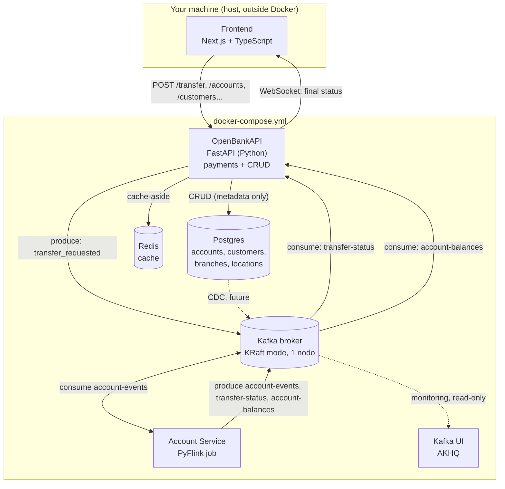

# OpenBankAPI — Technical Specification (v2)

## 0. Purpose of this document / changelog from v1

This supersedes `banking-payment-system-pyflink-spec.md` (v1). Same core
architecture (Kafka + PyFlink for the event-sourced ledger, per *Designing
Data-Intensive Applications* Ch. 13), with these changes:

- Project renamed **OpenBankAPI**.
- Full relational data model: `accounts`, `branches`, `locations`,
  `customers` (§3).
- A new Kafka topic, `account-balances`, and a new consumer — required to
  keep `accounts.balance` in sync without breaking the event-sourced design
  (§3.5, §4.3, §6).
- A Domain-Driven Design folder structure for the OpenBankAPI codebase (§7).

Hand this whole file to a coding agent as the spec to implement against —
it does not assume the agent has also read v1.

**Naming:** this revision states every table, column, endpoint and identifier in
English. Earlier drafts used Spanish domain terms (`cuentas`, `saldo`,
`sucursales`); the implementation is English throughout, and this document was
brought in line so there is exactly one vocabulary to reason about.

---

## 1. System goal

Transfer money between two accounts (source → destination) while deducting a
fee to a third account, **without a distributed transaction**. Correctness
comes from:

- A single atomic write of the initial request (to one Kafka partition).
- Deterministic, sequential per-account processing (Flink keyed state).
- A client-generated `request_id` used end-to-end for deduplication.
- At-least-once delivery + idempotent processing (exactly-once is a nice-to-have,
  not a hard requirement).

Non-goals (explicitly out of scope): real authentication, real settlement
with external banks/ISO 20022, multi-datacenter deployment, production
security hardening, real money.

---

## 2. Architecture



| Componente | Tecnología | Lenguaje |
|---|---|---|
| Frontend | Next.js (App Router) | TypeScript |
| OpenBankAPI | FastAPI + `confluent-kafka-python` + Postgres/Redis clients | Python |
| Streaming backbone | Apache Kafka, modo KRaft, 1 broker | — |
| Account Service | Apache Flink, PyFlink DataStream API | Python |
| Observability | AKHQ (Kafka UI) | — |
| Orquestación | Docker Compose | — |

OpenBankAPI is a **single deployable FastAPI process** with two internally
separate responsibilities: payment translation (HTTP/WS ↔ Kafka, §8.1) and
reference-data CRUD (Postgres/Redis, §8.2). Merged into one process
on purpose for local-prototype simplicity — see §12 for the trade-off.

---

## 3. Data model

### 3.1 Entity relationships

```
locations (1) ──< branches (1) ──< accounts >── (1) customers
```

- One `location` has many `branches`.
- One `branch` has many `accounts`.
- One `customer` can have many `accounts`.

### 3.2 `locations`

The user's spec was "a table with `name` and `id`" — kept minimal, with
timestamps added for the same audit reasons as every other table here.

```sql
CREATE TABLE locations (
    id UUID PRIMARY KEY DEFAULT gen_random_uuid(),
    name VARCHAR(150) NOT NULL,
    created_at TIMESTAMPTZ NOT NULL DEFAULT now(),
    updated_at TIMESTAMPTZ NOT NULL DEFAULT now()
);
```

### 3.3 `branches`

**Changed from v1:** dropped the free-text `direccion`/`region` columns in
favor of the `locations` FK, since that's what the new schema specifies.

```sql
CREATE TABLE branches (
    id UUID PRIMARY KEY DEFAULT gen_random_uuid(),
    code VARCHAR(10) UNIQUE NOT NULL,
    name VARCHAR(200) NOT NULL,
    location_id UUID NOT NULL REFERENCES locations(id),
    active BOOLEAN NOT NULL DEFAULT true,
    created_at TIMESTAMPTZ NOT NULL DEFAULT now(),
    updated_at TIMESTAMPTZ NOT NULL DEFAULT now()
);
```

### 3.4 `customers`

**Gaps filled (flagged explicitly, verify these match intent):**
- No `age` column — computed from `date_of_birth` at read time, never
  stored (a stored age goes stale the moment it's written).
- "id number" interpreted as a real-world identification number (DNI/
  cédula-equivalent) — a *business* identifier, distinct from the internal
  UUID primary key every other table in this system uses. Rename it if this
  guess is wrong.
- Added `active` + timestamps for the same reasons as every other entity.

```sql
CREATE TABLE customers (
    id UUID PRIMARY KEY DEFAULT gen_random_uuid(),
    identification_number VARCHAR(20) UNIQUE NOT NULL,
    first_name VARCHAR(100) NOT NULL,
    last_name VARCHAR(100) NOT NULL,
    date_of_birth DATE NOT NULL,
    gender VARCHAR(20),
    active BOOLEAN NOT NULL DEFAULT true,
    created_at TIMESTAMPTZ NOT NULL DEFAULT now(),
    updated_at TIMESTAMPTZ NOT NULL DEFAULT now()
);
```

`date_of_birth` and `gender` are personal data. Not adding access
control or encryption-at-rest for this prototype (out of scope per §1), but
don't log these fields in application logs — cheap to get right now, ugly
to retrofit later.

### 3.5 `accounts` — and the critical part: `balance` is not a normal column

**Changed from v1:** account identifiers are now real 16-digit account
numbers instead of placeholder strings like `"acc-123"`. This value is
**the same string used as the Kafka partition key (`account_id`)** in every
topic from §4 — no separate mapping, no lookup table. The 16-digit number
*is* the shard key.

```sql
CREATE TABLE accounts (
    id UUID PRIMARY KEY DEFAULT gen_random_uuid(),
    account_number CHAR(16) UNIQUE NOT NULL
        CHECK (account_number ~ '^[0-9]{16}$'),
    currency CHAR(3) NOT NULL,                    -- ISO 4217: USD, ARS, UYU...
    customer_id UUID NOT NULL REFERENCES customers(id),
    branch_id UUID NOT NULL REFERENCES branches(id),
    balance BIGINT NOT NULL DEFAULT 0,             -- cents. READ-ONLY. See below.
    status VARCHAR(20) NOT NULL DEFAULT 'active',-- active | blocked | closed
    created_at TIMESTAMPTZ NOT NULL DEFAULT now(),
    updated_at TIMESTAMPTZ NOT NULL DEFAULT now()
);
```

**`balance` must never be written by any CRUD endpoint.** This is the single
most important rule in this whole document. If a coding agent adds
`balance` to the `PUT /accounts/{account_number}` request DTO, it has broken
the entire architecture — it would create a second, uncoordinated write
path to the same fact (account balance) that Kafka + Flink already own,
which is exactly the "distributed transaction across heterogeneous
systems" problem this whole design exists to avoid.

`balance` in this table is a **read-model / CQRS query-side projection**,
kept eventually consistent with Flink's true state by a dedicated
mechanism (§3.6). The `controllers/dtos` DTO for updating a `account`
(§7) must not include a `balance` field at all — make it structurally
impossible to set, not just validated-away.

**Why this doesn't cause a chicken-and-egg problem at account creation:**
Flink lazily initializes an account's `balance` state to `0` the first time
it sees *any* event for that key (already specified in v1's processing
logic). Postgres also defaults `balance` to `0`. Both sides agree at t=0 with
no synchronization event required. If an account needs a non-zero opening
balance, don't write it directly to Postgres — have OpenBankAPI produce an
`incoming_payment` event (system-generated `request_id`) onto
`account-events`, the same event-sourced path every other credit takes.

### 3.6 Keeping `accounts.balance` in sync — the missing piece

`transfer-status` (v1) only carries the *source* account's `account_id` —
not enough to update the destination or fees account's balance in the read
model. This needs a **new Kafka topic**:

**`account-balances`**
- **Key:** `account_id` (the 16-digit `account_number`).
- **Cleanup policy:** `compact` — only the latest balance per account
  matters, unlike `account-events` which keeps full history.
- **Value:**
  ```json
  { "account_id": "1234567890123456", "balance": 458700, "ts": "2026-08-24T14:02:03Z" }
  ```
- **Produced by:** the Flink job (§6) — as a **third sink**, emitted every
  time `balance` state changes for any account (in the `transfer_requested`
  reservation and in every `incoming_payment` credit).
- **Consumed by:** a new background consumer in OpenBankAPI (§8.1) that
  upserts `UPDATE accounts SET balance = ?, updated_at = now() WHERE
  account_number = ?` for each message, and invalidates that account's Redis
  cache entry if present.

`GET /accounts/{account_number}` therefore returns an **eventually
consistent** view of the balance — same timeliness-vs-integrity trade-off
discussed for the credit card statement example: a few hundred
milliseconds of staleness on `balance` is fine, a wrong `balance` is not. If a
caller needs the authoritative up-to-the-instant balance, that's a
different, harder feature (not in scope here — it would mean querying
Flink's state directly, which runs into the same Queryable-State
limitations already discussed).

---

## 4. Kafka topics

### 4.1 `account-events`
- **Key:** `account_id` = 16-digit `account_number` (string).
- **Partitions:** 6. **Replication factor:** 1. **Cleanup:** `delete`, 7-day
  retention. **Value:** JSON (see §5).

### 4.2 `transfer-status`
- **Key:** `request_id` (UUID). **Partitions:** 3.
- Client-facing confirmation feed — what OpenBankAPI's WebSocket handler
  subscribes to.

### 4.3 `account-balances` (new in v2)
- **Key:** `account_id` = 16-digit `account_number`. **Partitions:** 6
  (match `account-events` so the same key always lands on a comparable
  partition count — not a hard requirement, just tidy).
- **Cleanup policy:** `compact` (not `delete` — see §3.6).
- Feeds the `accounts.balance` read-model sync consumer in OpenBankAPI.

---

## 5. Event schemas (JSON, all amounts in **integer cents**)

Account identifiers are realistic 16-digit numbers from here on.

### `transfer_requested`
Produced by OpenBankAPI onto `account-events`, keyed by `source_account`.
```json
{
  "type": "transfer_requested",
  "request_id": "b6e1...-uuid",
  "source_account": "1234567890123456",
  "destination_account": "6543210987654321",
  "fees_account": "0000000000000001",
  "amount": 1100,
  "fee_amount": 25,
  "ts": "2026-08-24T14:02:01Z"
}
```

### `outgoing_payment` / `incoming_payment` / `declined_payment`
Same shape as v1, `account_id` now a 16-digit number:
```json
{ "type": "outgoing_payment", "request_id": "b6e1...-uuid", "account_id": "1234567890123456", "amount": 1100, "ts": "..." }
{ "type": "incoming_payment", "request_id": "b6e1...-uuid", "account_id": "6543210987654321", "amount": 1100, "ts": "..." }
{ "type": "declined_payment", "request_id": "b6e1...-uuid", "account_id": "1234567890123456", "reason": "insufficient_funds", "ts": "..." }
```

### `transfer-status` event
```json
{ "request_id": "b6e1...-uuid", "status": "approved", "account_id": "1234567890123456", "ts": "..." }
```

### `account-balances` event (new)
```json
{ "account_id": "1234567890123456", "balance": 458700, "ts": "2026-08-24T14:02:03Z" }
```

---

## 6. Account Service — PyFlink job design

Same design as v1 (`KeyedProcessFunction` keyed by `account_id`, `balance`
+ `processed_ids` state, at-least-once delivery with idempotent dedup) —
see v1 §5 for the full processing-logic pseudocode and the job skeleton.
**One addition:** every branch of `process_element` that changes
`balance.value()` (the reservation in `transfer_requested`, and every
`incoming_payment` credit) must also emit a record to the **third sink**,
`account-balances`, keyed by the current account:

```python
out.collect_to_side_output(
    BALANCES_TAG,
    json.dumps({"account_id": account, "balance": balance.value(), "ts": now_iso()})
)
```

Wire a third `KafkaSink` for this (same pattern as the existing
`transfer-status` side-output sink in v1 §5.7), topic `account-balances`,
key = `account_id`.

---

## 7. OpenBankAPI — Domain-Driven Design structure

This applies to **OpenBankAPI only** (the FastAPI service). The PyFlink job
has a fundamentally different execution model (operators on a keyed
stream, not request handling) — don't force the same folder taxonomy onto
it. If you want an analogous split there, separate the pure decision logic
(§6, the `process_element` dispatch) from the Kafka source/sink wiring;
that's enough.

### 7.1 Folder tree

```
openbankapi/
├── main.py                       # composition root: builds FastAPI app, wires
│                                  # DB pool + Redis client + Kafka producer/consumers
│                                  # into the controllers
├── domain/
│   ├── model/
│   │   ├── account.py             # Account — aggregate root (balance invariants)
│   │   ├── customer.py            # Customer entity
│   │   ├── branch.py           # Branch entity
│   │   └── location.py           # Location entity/value object
│   ├── events/
│   │   ├── transfer_requested.py
│   │   ├── account_created.py
│   │   └── balance_updated.py
│   ├── service/
│   │   └── transfer_service.py   # use-case logic: validate transfer, compute
│   │                                   # fees, call repositories from infra
│   └── exceptions.py             # InsufficientFundsError, AccountNotFoundError, ...
├── controllers/
│   ├── dtos/                     # Pydantic request/response DTOs (the API contract)
│   │   ├── transfer_dto.py
│   │   ├── account_dto.py         # AccountUpdateDTO has NO balance field — see §3.5
│   │   ├── customer_dto.py
│   │   └── branch_dto.py
│   ├── transfer_controller.py
│   ├── account_controller.py
│   ├── customer_controller.py
│   └── branch_controller.py
└── infra/
    ├── database/
    │   ├── models.py              # ORM table definitions (matches §3 schemas)
    │   ├── interfaces/            # repository contracts
    │   │   ├── account_repository.py       # IAccountRepository
    │   │   ├── customer_repository.py
    │   │   ├── branch_repository.py
    │   │   └── location_repository.py
    │   └── repositories/          # concrete Postgres implementations
    │       ├── postgres_account_repository.py
    │       ├── postgres_customer_repository.py
    │       └── postgres_branch_repository.py
    ├── cache/
    │   ├── interfaces/
    │   │   └── cache_service.py  # ICacheService port
    │   └── adapters/
    │       └── redis_cache_adapter.py
    └── kafka/
        ├── interfaces/
        │   └── event_publisher.py     # IEventPublisher port
        ├── adapters/
        │   └── kafka_producer_adapter.py  # confluent-kafka wrapper, implements the port
        └── services/
            ├── transfer_status_consumer.py  # WS fan-out (v1 §8.1 behavior)
            └── account_balance_consumer.py  # NEW — syncs accounts.balance, §3.6
```

### 7.2 Notes on this structure

- **`main.py` at the project root**, sibling to `domain/`, `controllers/`,
  `infra/` — not nested inside any of them. It's the one place allowed to
  know about every concrete adapter and wire them together.
- **`infra/cache` added.** Redis had no home in the original proposal.
- **Repositories live entirely in `infra/database`** — both the contract
  (`interfaces/`) and the implementation (`repositories/`). `domain/service`
  calls into the interface to run its use cases; it doesn't own the
  contract. This is a deliberate choice: repositories *are* database access,
  which is an infrastructure concern end to end, and `domain/service` is
  where the actual use-case logic (validate a transfer, decide whether a
  branch code is available, etc.) lives and orchestrates those calls.
- **`domain/exceptions.py` added.** Domain-specific errors
  (`InsufficientFundsError`, `AccountNotFoundError`,
  `DuplicateAccountNumberError`) belong in the domain layer; controllers
  catch them and translate to HTTP status codes — that translation is the
  controller's job, not the domain's.
- **`domain/events/` added**, as its own top-level folder next to `model/`
  and `service/` — not nested inside `model/`. First-class domain event
  definitions, independent of their Kafka/JSON wire format.
  `infra/kafka/adapters` serializes a domain event into the JSON shapes
  from §5 — the domain layer never imports anything Kafka-related.
- **`controllers/dtos/`** (not `controllers/interfaces/`) for Pydantic
  request/response models, distinct from `domain/model` entities. Don't
  return domain entities directly from an endpoint — map them to a DTO.
  This is what makes it structurally impossible to leak a `balance` field
  into a `PUT` request body (§3.5): the DTO simply doesn't declare one.
- **No separate `application`/use-case layer.** `domain/service` absorbs
  use-case orchestration for now. Worth splitting out later only if
  `transfer_service.py` (or similar) grows unwieldy — not needed at
  this project's current size.

---

## 8. OpenBankAPI — endpoints

### 8.1 Payment endpoints (HTTP/WS ↔ Kafka) — `controllers/transfer_controller.py`

Same three endpoints as v1: `POST /transfer`, `GET
/transfer/{request_id}/status`, `WS /ws/transfer/{request_id}`. Behavior
unchanged — see v1 §6.1 if you need the full detail. One addition: this
controller's background Kafka consumer set now includes
`account_balance_consumer.py` (§7.1, §3.6) alongside the existing
`transfer_status_consumer.py`.

### 8.2 Reference data (CRUD) endpoints — Postgres + Redis, cache-aside

Same CRUD + cache-aside + soft-delete pattern as v1 for **all four**
entities (`locations`, `branches`, `customers`, `accounts`). Cache key
convention: `{entity}:{id}` (e.g. `account:1234567890123456`,
`customer:{uuid}`), 5-minute TTL, explicit invalidation on write.

| Entity | Create | Read | List | Update | Delete |
|---|---|---|---|---|---|
| `locations` | `POST /locations` | `GET /locations/{id}` | `GET /locations` | `PUT /locations/{id}` | — (no delete; referenced by `branches`) |
| `branches` | `POST /branches` | `GET /branches/{id}` | `GET /branches` | `PUT /branches/{id}` | Soft (`active=false`) |
| `customers` | `POST /customers` | `GET /customers/{id}` | `GET /customers` | `PUT /customers/{id}` | Soft (`active=false`) |
| `accounts` | `POST /accounts` | `GET /accounts/{account_number}` | `GET /accounts` | `PUT /accounts/{account_number}` — **never `balance`** | Soft (`status='closed'`) |

`POST /accounts` generates `account_number` server-side (16 random digits,
retry on the `UNIQUE` constraint violation) rather than accepting it from
the client — this is the value that becomes the Kafka partition key, so it
has to be correct by construction, not by request validation.

---

## 9. Frontend — minimal spec

Same as v1: single page, Next.js (App Router) + TypeScript, calls
OpenBankAPI directly (`fetch` for HTTP, native `WebSocket` for
confirmation), CORS enabled on OpenBankAPI for the Next.js origin. Add
simple forms for the new CRUD entities (`accounts`, `customers`,
`branches`, `locations`) following the same submit → confirm pattern as
the transfer form — no new architectural ground here, just more forms.

---

## 10. Docker Compose — required services

Same set as v1: `kafka`, `kafka-init` (now also creates the
`account-balances` topic, compacted, 6 partitions), `flink-jobmanager` +
`flink-taskmanager`, `postgres` (`wal_level=logical`, init script creates
all four tables from §3), `redis`, `gateway` (OpenBankAPI, `depends_on:
[kafka, postgres, redis]`), `kafka-ui`. Frontend still runs on the host via
`npm run dev`, not in Compose.

---

## 11. Acceptance criteria / test scenarios

All of v1's scenarios still apply (happy path, insufficient funds,
duplicate request, crash-recovery, concurrent requests, sharding sanity
check, CRUD cache correctness, CRUD soft delete — generalized to whichever
entity is under test). New for v2:

1. **Account creation** — `POST /accounts` with a valid `customer_id` and
   `branch_id` returns a 16-digit `account_number` and `balance: 0`.
   Retrying with a colliding generated number (force it in a test) doesn't
   surface a `500` — the retry-on-`UNIQUE`-violation logic kicks in
   transparently.
2. **Balance read-model sync** — perform a transfer between two existing
   accounts; poll `GET /accounts/{account_number}` for both source and
   destination until `balance` reflects the transfer (bounded wait, e.g. 5s);
   confirm it matches what Flink's state produced.
3. **`balance` is not writable** — attempt `PUT /accounts/{account_number}`
   with a `balance` field in the body; confirm it's rejected at the DTO
   validation layer (422) or silently ignored — either is acceptable, a
   changed balance is not.
4. **Referential integrity** — attempt to create a `branch` with a
   nonexistent `location_id`, or a `account` with a nonexistent
   `customer_id`/`branch_id`; confirm a clean `4xx`, not a raw DB
   constraint error leaking to the client.

---

## 12. Things to keep in mind

- The PyFlink job's code skeleton (v1 §5.7) is a design guide, not something
  that will compile as-is — PyFlink's exact signatures change between versions,
  so it has to be adjusted against whichever version gets installed.
- OpenBankAPI merges payments and reference-data CRUD into a single FastAPI
  process on purpose — a simplicity decision for a local prototype, not the
  "correct" shape for production. The more realistic pattern would be an edge
  API gateway (Traefik, say) routing by path to separate services. Revisit this
  if the project grows beyond a prototype.
- `balance` on `accounts` is a projection, not the source of truth — if
  balances ever feel "off" (visible delay, transient inconsistencies), the
  first thing to check is the `account-balances` consumer (§3.6), not Flink's
  logic.
- `date_of_birth` and `gender` on `customers` are personal data — do not log
  them, even though the rest of the security controls are out of scope for this
  prototype.
