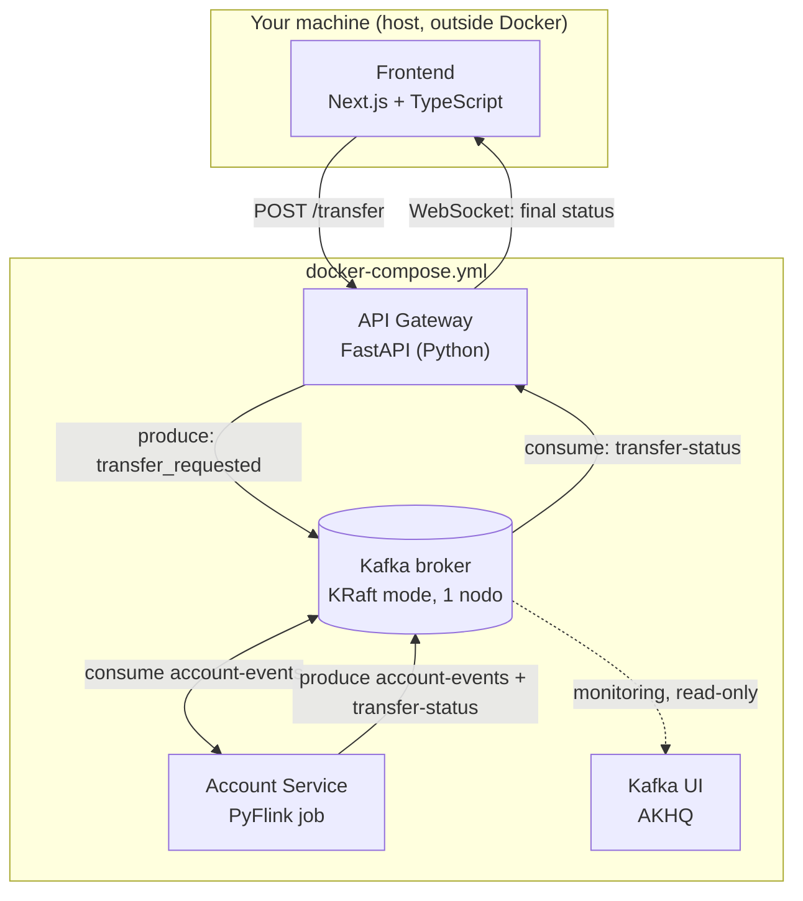

# Banking Payment System — Technical Specification (PyFlink Edition)

## 0. Purpose of this document

This is an implementation spec for a local, testable proof-of-concept of a
multishard payment system built on event logs and stream processing, per the
architecture described in *Designing Data-Intensive Applications*, Ch. 13
("Multishard request processing" / "Enforcing Constraints"). It replaces the
Kafka Streams (JVM) account processor with an **Apache Flink job using the
PyFlink DataStream API**, so the entire stack is programmable in Python +
TypeScript/JS, no Java.

Hand this whole file to a coding agent as the spec to implement against.

---

## 1. System goal

Transfer money between two accounts (source → destination) while deducting a
fee to a third account, **without a distributed transaction**. Correctness
comes from:

- A single atomic write of the initial request (to one Kafka partition).
- Deterministic, sequential per-account processing (Flink keyed state).
- A client-generated `request_id` used end-to-end for deduplication.
- At-least-once delivery + idempotent processing (exactly-once is a nice-to-have,
  not a hard requirement — see §6.4).

Non-goals (explicitly out of scope): real authentication, real settlement
with external banks/ISO 20022, multi-datacenter deployment, production
security hardening, real money.

---

## 2. Architecture



| Componente | Tecnología | Lenguaje |
|---|---|---|
| Frontend | Next.js (App Router) | TypeScript |
| API Gateway | FastAPI + `confluent-kafka-python` | Python |
| Streaming backbone | Apache Kafka, modo KRaft, 1 broker | — |
| Account Service | Apache Flink, PyFlink DataStream API | Python |
| Observability | AKHQ (Kafka UI) | — |
| Orquestación | Docker Compose | — |

---

## 3. Kafka topics

### 3.1 `account-events`
- **Key:** `account_id` (string) — this *is* the shard. All events for a
  given account always land in the same partition.
- **Partitions:** 6 (local dev — enough to see sharding behavior without
  needing multiple brokers).
- **Replication factor:** 1 (single local broker).
- **Cleanup policy:** `delete`, retention 7 days.
- **Value format:** JSON (see §4). Production would use Avro + Schema
  Registry; skip that for this exercise.

### 3.2 `transfer-status`
- **Key:** `request_id` (string, UUID).
- **Partitions:** 3.
- **Purpose:** client-facing confirmation feed, decoupled from the internal
  account ledger stream so the Gateway doesn't have to filter the whole
  `account-events` stream to find one client's result.

---

## 4. Event schemas (JSON, all amounts in **integer cents**)

### `transfer_requested`
Produced by the **API Gateway** onto `account-events`, keyed by `source_account`.

```json
{
  "type": "transfer_requested",
  "request_id": "b6e1...-uuid",
  "source_account": "acc-123",
  "destination_account": "acc-456",
  "fees_account": "acc-fees",
  "amount": 1100,
  "fee_amount": 25,
  "ts": "2026-08-24T14:02:01Z"
}
```

### `outgoing_payment`
Produced by the **Flink job**, back onto `account-events`, keyed by
`account_id` = the source account (this is the "write to its own input log"
step from the book).

```json
{ "type": "outgoing_payment", "request_id": "b6e1...-uuid", "account_id": "acc-123", "amount": 1100, "ts": "..." }
```

### `incoming_payment`
Produced by the **Flink job** onto `account-events`, keyed by `account_id` =
destination or fees account. One of these is emitted per beneficiary.

```json
{ "type": "incoming_payment", "request_id": "b6e1...-uuid", "account_id": "acc-456", "amount": 1100, "ts": "..." }
```

### `declined_payment`
Produced by the **Flink job** onto `account-events`, keyed by `account_id` =
source account, when balance is insufficient.

```json
{ "type": "declined_payment", "request_id": "b6e1...-uuid", "account_id": "acc-123", "reason": "insufficient_funds", "ts": "..." }
```

### `transfer-status` event
Produced by the **Flink job** onto `transfer-status`, keyed by `request_id`.
This is what the Gateway subscribes to.

```json
{ "request_id": "b6e1...-uuid", "status": "approved", "account_id": "acc-123", "ts": "..." }
```
`status` is `"approved"` or `"declined"`; include `"reason"` when declined.

---

## 5. Account Service — PyFlink job design

### 5.1 Stream & keying

One `KeyedProcessFunction` consumes `account-events`, **keyed by `account_id`**.
Flink guarantees all events for a given key are processed by the same task,
strictly in arrival order — this *is* the "single thread reads a log shard
sequentially" property the whole design depends on.

### 5.2 State (scoped per key, i.e. per account)

| State | Type | Purpose |
|---|---|---|
| `balance` | `ValueState[int]` | current balance, in cents |
| `processed_ids` | `MapState[str, bool]` | request_ids already applied to *this* account — the deduplication guard |

Configure `StateTtlConfig` on `processed_ids` (e.g. 7-day TTL) so it doesn't
grow unbounded — old request_ids stop mattering once nothing will ever retry
that far back.

### 5.3 Processing logic

```
on process_element(event, ctx, out):
    account = ctx.get_current_key()

    if event.type == "transfer_requested":
        # only the SOURCE account's partition acts on this event type
        if processed_ids.contains(event.request_id):
            return  # duplicate delivery, already handled — no-op
        if balance.value() is None:
            balance.update(0)  # or seed initial balances out-of-band before testing
        if balance.value() >= event.amount + event.fee_amount:
            balance.update(balance.value() - event.amount - event.fee_amount)
            processed_ids.put(event.request_id, True)
            out.collect(outgoing_payment(event))                      # -> account-events, key=source
            out.collect(incoming_payment(event, event.destination_account, event.amount))  # key=destination
            out.collect(incoming_payment(event, event.fees_account, event.fee_amount))       # key=fees
        else:
            out.collect(declined_payment(event, reason="insufficient_funds"))  # key=source
            emit_status(event.request_id, "declined", account, "insufficient_funds")

    elif event.type == "incoming_payment":
        if processed_ids.contains(event.request_id):
            return
        balance.update((balance.value() or 0) + event.amount)
        processed_ids.put(event.request_id, True)

    elif event.type == "outgoing_payment":
        # loopback confirmation: this account's own log now durably has the
        # debit. Nothing left to apply to balance (already reserved above) —
        # this is purely the client-facing confirmation trigger.
        emit_status(event.request_id, "approved", account)

    elif event.type == "declined_payment":
        emit_status(event.request_id, "declined", account, event.reason)
```

`emit_status(...)` writes to a **side output** routed to the `transfer-status`
sink (see §5.5) — it's a different topic from `account-events`, so it can't
just be `out.collect()` on the main collector.

### 5.4 Fan-out / re-keying across accounts — the key design detail

Flink's `key_by(account_id)` controls **which task processes an event and
which state it can touch** — it does **not** constrain what account the
*output* records target. When the function emits `incoming_payment` events
for the destination and fees accounts, those output records simply carry
**their own** `account_id` field (different from the key the function is
currently running under).

The `KafkaRecordSerializationSchema` on the sink reads the Kafka message key
**from each output record's own `account_id` field**, not from Flink's
internal partitioning key. That's what re-routes each event to the correct
partition/shard on the way out — same mechanism the book describes, expressed
in Flink's idiom instead of Kafka Streams' `context.forward()`.

```python
KafkaRecordSerializationSchema.builder() \
    .set_topic("account-events") \
    .set_key_serialization_schema(lambda e: e["account_id"].encode("utf-8")) \
    .set_value_serialization_schema(SimpleStringSchema()) \
    .build()
```

### 5.5 Sinks

Two Kafka sinks off this job:
1. `account-events` sink — receives `outgoing_payment`, `incoming_payment`,
   `declined_payment` (main output).
2. `transfer-status` sink — receives status events, keyed by `request_id`,
   via a **side output tag** (`OutputTag("status-events")`) so it doesn't mix
   with the main `account-events` stream.

### 5.6 Delivery guarantee & checkpointing

The book's own algorithm is designed to tolerate **at-least-once** delivery
plus idempotent dedup by `request_id` — that's already implemented in §5.3.
So:

- **Default recommendation:** `DeliveryGuarantee.AT_LEAST_ONCE` on both
  sinks. Simpler, lower latency, and the dedup logic already makes it safe.
- **Optional hardening:** `DeliveryGuarantee.EXACTLY_ONCE` (Flink's
  transactional 2-phase-commit Kafka sink) as defense-in-depth. Trade-off:
  output only becomes visible to consumers once a checkpoint completes, which
  adds latency to the confirmation the Gateway is waiting on. If you enable
  this, set `transactional.id` prefixes explicitly and keep the checkpoint
  interval short (e.g. 3–5s) to bound that latency.

Checkpointing config (needed regardless of delivery guarantee, since it's
what makes `balance` / `processed_ids` state durable across restarts):

```python
env.enable_checkpointing(5000)  # ms
env.get_checkpoint_config().set_checkpointing_mode(CheckpointingMode.EXACTLY_ONCE)
# state backend: RocksDB for anything beyond a toy dataset
env.set_state_backend(EmbeddedRocksDBStateBackend())
env.get_checkpoint_config().set_checkpoint_storage_dir("file:///tmp/flink-checkpoints")  # local dev only
```

Note: `CheckpointingMode.EXACTLY_ONCE` here refers to **Flink's internal
state consistency** (state matches exactly the messages consumed so far) —
independent of whether the *Kafka sink* is set to `AT_LEAST_ONCE` or
`EXACTLY_ONCE` delivery. Keep the former on regardless; it's what protects
`balance` and `processed_ids` from crash-induced corruption.

### 5.7 Job skeleton (reference sketch — verify exact API against your PyFlink version)

```python
from pyflink.datastream import StreamExecutionEnvironment, CheckpointingMode
from pyflink.datastream.functions import KeyedProcessFunction, RuntimeContext
from pyflink.datastream.state import ValueStateDescriptor, MapStateDescriptor, StateTtlConfig
from pyflink.datastream.connectors.kafka import (
    KafkaSource, KafkaSink, KafkaRecordSerializationSchema, KafkaOffsetsInitializer,
)
from pyflink.datastream.connectors.base import DeliveryGuarantee
from pyflink.common.serialization import SimpleStringSchema
from pyflink.common import Types, OutputTag
import json, time

STATUS_TAG = OutputTag("status-events", Types.STRING())

class AccountProcessor(KeyedProcessFunction):
    def open(self, ctx: RuntimeContext):
        ttl_cfg = StateTtlConfig.new_builder(StateTtlConfig.Time.days(7)).build()
        bal_desc = ValueStateDescriptor("balance", Types.LONG())
        ids_desc = MapStateDescriptor("processed_ids", Types.STRING(), Types.BOOLEAN())
        ids_desc.enable_time_to_live(ttl_cfg)
        self.balance = ctx.get_state(bal_desc)
        self.processed_ids = ctx.get_map_state(ids_desc)

    def process_element(self, value, ctx):
        event = json.loads(value)
        account = ctx.get_current_key()
        # ... dispatch on event["type"] per the pseudocode in §5.3 ...
        # use ctx.output(STATUS_TAG, json.dumps(status_event)) for the side output

def build_job():
    env = StreamExecutionEnvironment.get_execution_environment()
    env.enable_checkpointing(5000, CheckpointingMode.EXACTLY_ONCE)

    source = KafkaSource.builder() \
        .set_bootstrap_servers("kafka:9092") \
        .set_topics("account-events") \
        .set_group_id("account-service") \
        .set_starting_offsets(KafkaOffsetsInitializer.earliest()) \
        .set_value_only_deserializer(SimpleStringSchema()) \
        .build()

    stream = env.from_source(source, watermark_strategy=None, source_name="account-events") \
        .key_by(lambda v: json.loads(v)["account_id"])

    processed = stream.process(AccountProcessor(), output_type=Types.STRING())

    events_sink = KafkaSink.builder() \
        .set_bootstrap_servers("kafka:9092") \
        .set_record_serializer(
            KafkaRecordSerializationSchema.builder()
                .set_topic("account-events")
                .set_key_serialization_schema(lambda e: json.loads(e)["account_id"].encode())
                .set_value_serialization_schema(SimpleStringSchema())
                .build()
        ) \
        .set_delivery_guarantee(DeliveryGuarantee.AT_LEAST_ONCE) \
        .build()
    processed.sink_to(events_sink)

    status_sink = KafkaSink.builder() \
        .set_bootstrap_servers("kafka:9092") \
        .set_record_serializer(
            KafkaRecordSerializationSchema.builder()
                .set_topic("transfer-status")
                .set_key_serialization_schema(lambda e: json.loads(e)["request_id"].encode())
                .set_value_serialization_schema(SimpleStringSchema())
                .build()
        ) \
        .set_delivery_guarantee(DeliveryGuarantee.AT_LEAST_ONCE) \
        .build()
    processed.get_side_output(STATUS_TAG).sink_to(status_sink)

    env.execute("account-service")

if __name__ == "__main__":
    build_job()
```

---

## 6. API Gateway — FastAPI spec

### `POST /transfer`
- **Request body:**
  ```json
  { "source_account": "acc-123", "destination_account": "acc-456", "amount": 1100 }
  ```
- **Behavior:** generate `request_id` (UUID4) server-side, compute
  `fee_amount` (flat or %, your call), produce a `transfer_requested` event to
  `account-events` keyed by `source_account`, then return **immediately**.
- **Response (`202 Accepted`):**
  ```json
  { "request_id": "b6e1...-uuid", "status": "pending" }
  ```
  Do **not** wait for the Flink job here — this is the write path, and per
  §1 the read/confirmation path is separate and asynchronous.

### `GET /transfer/{request_id}/status`
Fallback pull-style endpoint for clients that don't want a WebSocket: reads
the last known status for that `request_id` from an in-memory dict the
Gateway maintains (populated by its `transfer-status` consumer — see below).
Returns `404`/`{"status": "pending"}` if not yet resolved.

### `WS /ws/transfer/{request_id}`
- On connect, if `request_id` is already resolved (cache hit), push the
  status immediately and close.
- Otherwise, hold the connection open; a background task consuming
  `transfer-status` pushes to any matching open connection as soon as the
  event with that key arrives, then closes it.
- Implementation note: the Gateway needs exactly **one** long-lived Kafka
  consumer on `transfer-status` (not one per WebSocket connection), fanning
  out in-process to whichever connections are waiting on a given
  `request_id`.

---

## 7. Frontend — minimal spec

Single page, **Next.js (App Router) + TypeScript**:
- A form (client component, `"use client"`): source account, destination
  account, amount.
- On submit: `fetch(POST /transfer)` **directly against the Gateway**
  (e.g. `http://localhost:8000/transfer`) from the browser — the Gateway
  already is the HTTP boundary, so don't duplicate that logic in a Next.js
  Route Handler / Server Action. Get `request_id` back, show "processing…".
- Open `WS /ws/transfer/{request_id}` (native browser `WebSocket`, also from
  a client component) directly against the Gateway; update UI to
  "approved ✅" or "declined ❌ (<reason>)" when the message arrives.
- **CORS:** since the Next.js dev server and the Gateway run on different
  ports, enable CORS on the FastAPI side for the Next.js origin
  (`http://localhost:3000`).
- No auth, no styling requirements — this is a test harness, not a product.

---

## 8. Docker Compose — required services

- `kafka` — `apache/kafka:latest`, KRaft mode, single node, ports `9092`
  (and an external listener if the host needs to reach it directly).
- `kafka-init` (one-shot) — creates `account-events` (6 partitions) and
  `transfer-status` (3 partitions) on startup.
- `flink-jobmanager` + `flink-taskmanager` (or a single combined container
  for local dev) — running the job from §5.7. Package the PyFlink job with
  its dependencies (`apache-flink`, Kafka connector JAR) into the image.
- `gateway` — the FastAPI service from §6.
- `kafka-ui` — AKHQ, pointed at the `kafka` service, for visual debugging.
- Frontend is **not** in Compose — run it on the host via `npm run dev`
  (Next.js dev server, port 3000) for fast iteration.

---

## 9. Acceptance criteria / test scenarios

The coding agent should implement and pass these before calling it done:

1. **Happy path** — sufficient balance → `outgoing_payment` +
   `incoming_payment` × 2 land in `account-events`; `transfer-status` shows
   `approved`; source balance decreases by `amount + fee_amount`; destination
   and fees balances increase correctly.
2. **Insufficient funds** — `declined_payment` emitted, no balance changes
   anywhere, `transfer-status` shows `declined`.
3. **Duplicate `transfer_requested`** (same `request_id` sent twice,
   simulating an at-least-once redelivery) — balance is only ever debited
   once; second occurrence is a silent no-op.
4. **Crash-recovery** — kill the Flink job mid-processing (after a checkpoint,
   before the next one), restart from the last checkpoint, replay the
   in-flight message: no double-processing, final state matches the
   happy-path outcome.
5. **Concurrent requests on the same source account** — fire two
   `transfer_requested` events for the same `source_account` back-to-back;
   verify they're applied strictly in the order they landed in that
   partition (no lost update on `balance`).
6. **Sharding sanity check** — using Kafka UI, confirm that two different
   `account_id`s consistently map to the same partition across multiple
   requests (verifies the hash-based key routing is doing what §3.1 claims).

---

## 10. Things to keep in mind

- The code skeleton in §5.7 is a design guide, not something that will compile
  as-is — PyFlink's exact signatures change between versions, so it has to be
  adjusted against whichever version gets installed.